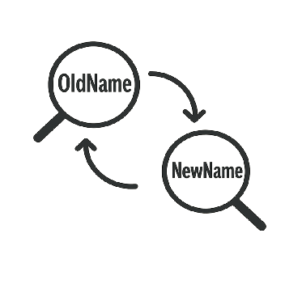

# Azure AI Foundry Rebranding Scripts

Specialized scripts for replacing terminology across markdown and YAML files, with intelligent handling of first mentions and context preservation.



## Prerequisites

- Python 3.7+ installed on your machine. You can download it from the [official Python website](https://www.python.org/downloads/).

## Setup

1. **Clone this repository** and navigate to the project directory:

   ```bash
   cd rebrand
   ```

2. **Create a virtual environment** (recommended):

   ```bash
   python -m venv venv
   ```

3. **Activate the virtual environment**:
   - On Windows (PowerShell): `.\venv\Scripts\Activate.ps1`
   - On Windows (Command Prompt): `.\venv\Scripts\activate.bat`
   - On macOS/Linux: `source venv/bin/activate`

4. **Install required packages**:

   ```bash
   pip install -r requirements.txt
   ```

## Configuration

**Edit the `.env` file** to specify the directory to process:

```env
# Directory path to process
DIRECTORY_PATH=C:\path\to\your\target\directory
```

The scripts use CSV configuration files in the `patterns/` folder:

- `always.csv` - Terms that are always replaced (compound phrases and special formatting)
- `cleanup.csv` - Final cleanup replacements applied last
- `never.csv` - Terms that should never be changed (URLs, code references, etc.)

## How It Works

### Markdown Files (`rebrand-aif-md.py`)

This script implements sophisticated replacement logic for `.md` files:

1. **Front Matter Detection**: Detects YAML front matter and applies different rules
2. **First Mention Logic**:
   - In metadata/front matter: "Azure AI Foundry" → "Microsoft Foundry"
   - First occurrence in body: "Azure AI Foundry" → "Microsoft Foundry"
   - Subsequent occurrences: "Azure AI Foundry" → "Foundry"
3. **Context Preservation**: Preserves historical references with "formerly", "previously", "originally"
4. **Protection**: Never-replace terms are protected during processing
5. **Processing Order**:
   - Load and protect never-replace terms
   - Apply replacements from `always.csv`
   - Apply main "Azure AI Foundry" logic with first mention handling
   - Apply final cleanup from `cleanup.csv`
   - Restore protected terms

### YAML Files (`rebrand-aif-yml.py`)

This script provides simpler replacement logic for `.yml` files:

1. **Uniform Replacement**: All "Azure AI Foundry" → "Microsoft Foundry" (no first mention logic)
2. **Protection**: Never-replace terms are still protected
3. **Processing Order**:
   - Load and protect never-replace terms  
   - Apply replacements from `always.csv`
   - Replace all "Azure AI Foundry" instances
   - Apply cleanup from `cleanup.csv`
   - Restore protected terms

## Usage

1. **Create a new branch** in your target repository:

   ```bash
   git checkout -b rebrand-foundry
   ```

2. **Run the appropriate script**:

   ```bash
   # For markdown files
   python rebrand-aif-md.py
   
   # For YAML files  
   python rebrand-aif-yml.py
   ```

3. **Enable debug mode** to see detailed changes:

   ```bash
   # Windows PowerShell
   $env:DEBUG="true"; python rebrand-aif-md.py
   
   # Command line
   set DEBUG=true && python rebrand-aif-md.py
   ```

4. **Review the changes**:
   - Check git diffs to verify expected changes
   - Ensure historical contexts are preserved
   - Verify never-replace terms remain unchanged

## Files

### Core Scripts

- `rebrand-aif-md.py` - Main script for markdown files with first mention logic
- `rebrand-aif-yml.py` - Script for YAML files with uniform replacement
- `utils.py` - Shared utility functions for both scripts

### Configuration Files

- `.env` - Directory path configuration  
- `patterns/always.csv` - Compound phrases and special formatting replacements
- `patterns/cleanup.csv` - Final cleanup replacements
- `patterns/never.csv` - Protected terms that should never change

### Dependencies

- `requirements.txt` - Python package dependencies
